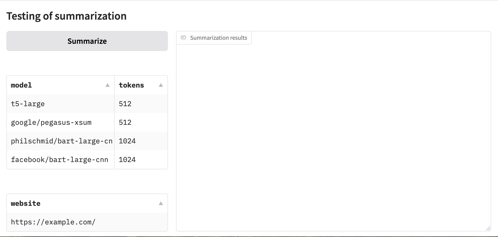

# Testing of summarization

An application for automatically summarizing the text of websites

## Getting Started

1. Build the Docker image:
   ```
   docker build -t summarization .
   ```

2. Run the Docker container, mounting your data directory:
   ```
   docker run -d --name app_summarization -v $(pwd)/app:/home/app -v $(pwd)/data:/home/data -p 7860:7860 summarization
   ```
   or<br>
   ```
   docker-compose up --build
   ```
**Dashboard:** http://localhost:7860

